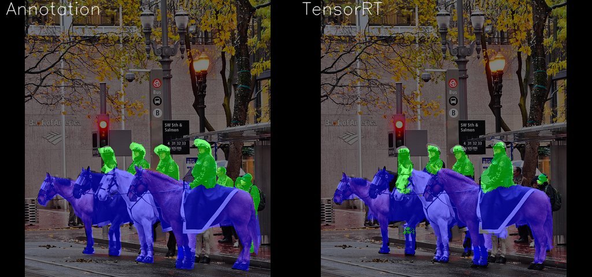
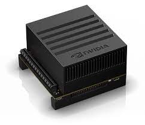
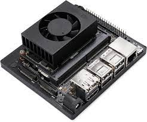
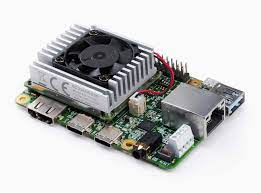
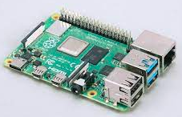
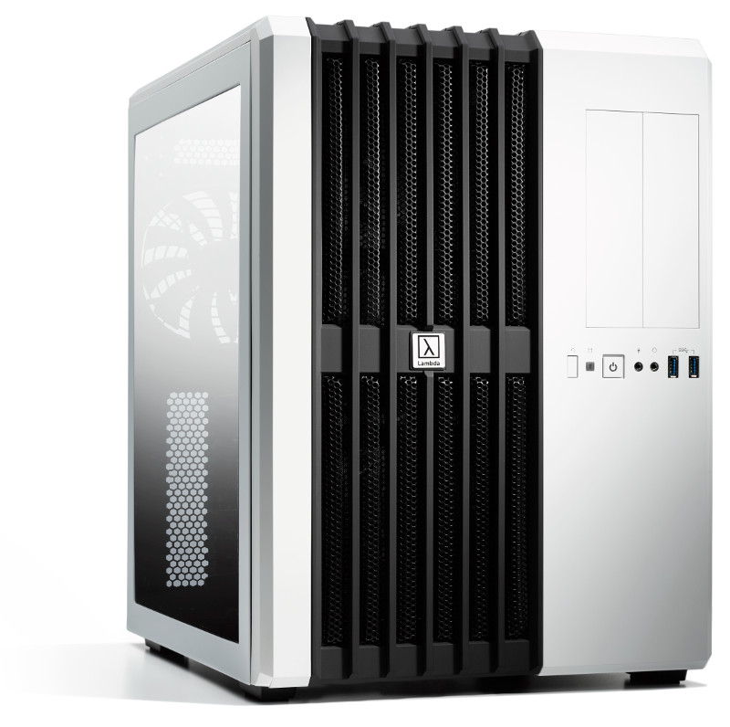
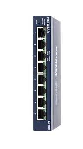
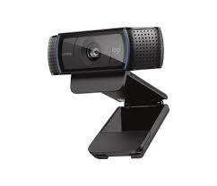
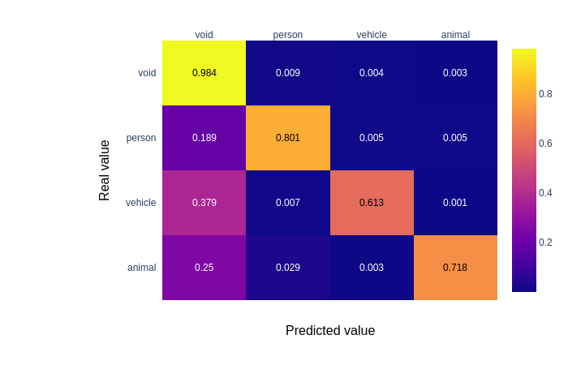

# Embedded Machine Learning Library (mllib)

<p> This embedded machine learning library is a workspace to explore embedding computer vision 
machine learning algorithms.  Its scope is the full supervised machine learning workflow - 
(acquire, annotate, train, test, optimize, deploy, validate).  mllib employs a microservices arctitecture. 

Mllib image segmetation using the unet network and trained using the coco dataset is shown below.  The left image illustrates a human segmented validation image and right shows the results of Tensorflow training and conversion to TensorRT Float16 inference on Jetson NX.  This project explores the process of creating and transforming models to performed machine learned impage processing on embedded hardware.




mllib is currently a sandbox to explore ideas and techniques.  As such, it is a useful location 
to experiment with new techniques.  It is not a stable repository with consistent interfaces.

The mllib toolset includes:  Tensorflow 2, Keras, Jupyter, TensorRT, TensorflowLite, Visual Studio Code, Docker, airflow, and Kubernetes.  The target embedded hardware includes [Jetson AGX](https://developer.nvidia.com/embedded/jetson-agx-xavier), [Jetson NX](https://developer.nvidia.com/embedded/jetson-xavier-nx-devkit), [Google Corel](https://coral.ai/products/dev-board/), and [Raspberry Pi](https://www.raspberrypi.org/products/raspberry-pi-4-model-b/)
</br>






## Repository Structure
mllib directories define specific steps to perform supervised machine learning.  The README.md within these subdirectories describe how to perform each step.  This include:
- [datasets](./datasets/README.md): dataset processing algorithms
- [networks](./networks/README.md): convolutional nural networks (CNN) used by other image processing algorithms
- [classify](./classify/README.md): algorithms to train and test classification networks
- [segment](./segment/README.md): algorithms to train and test segmentation networks
- [target](./target/README.md): instructions in scripts to prepare and target PC, Jetson, Corel, and Raspberry Pi boards
- [serve](./serve/README.md): model inference on target platforms
- utils: shared utility libraries

## Process
Embedded machine learned image processing is an emerging field.  Although science fiction and its close cousin, press headlines, build the impression that the area is stable and mature, this is far from the case.  Consiquently, the process I recommend is very quick development cycles moving algorithms quickly from devlopment to test on the target platform.  In this past, moving algorithms from a development environment to embedded hardware would have involved a complete rewrite of software in an new runtime environment, all of these target systems run linux, can execute pythion algorithms in vitualized docker environments with hardware access to powerful machine learning coprocessors.  Consiquently, my embedded machine learning process is to create an algorithm and with little or no training or optimization, move it and test it in the embedded environment.  This verifies the entire tool chain can handle the model structure.  Once any targeting problems are rectivied, model training and optimization is improved and target performance is verified.

To target Jetson boards, I am using the [Tensorflow->ONNX->TensorRT](https://developer.nvidia.com/blog/speeding-up-deep-learning-inference-using-tensorflow-onnx-and-tensorrt/) path.  For Corel and Raspberry Pi, I am following the TensorFlow->[Tensorflow Lite](https://www.tensorflow.org/lite/microcontrollers) path.

## Development Environment
The basics of a embedded ML imaging environment include a development workstation, network, embedded device and webcam.
</br>




</br>

- I prefer a deep learning workstation (e.g. [lambda workstation](https://lambdalabs.com/)) rather than cloud for development.  This will host your development environment, datasets, and provide objet storage to share data between the development and embedded environments.  This can be built up from a current workstation or purchased as a complete sytem.  
- The key component of a deep learning workstaiton is the GPU where training and inference is performed.  If there were not a global semiconductior shortage, a variety of gaming to professional graphics cards are available at a wide price point. At this writing [Titan RTX](https://www.nvidia.com/en-us/deep-learning-ai/products/titan-rtx/) with 24GB memory for big models and batch sizes would be a good choice.  This is a moving target and will take some research.
- After GPU, system memory is my biggest bottleneck to keeping the GPU working efficiently.  A rule of thumb I have followed is 2x system meomory to GPU memory ( e.g. 48 GB RAM for a 24GB Titan RTX memory).  
- Next is storage for big datasets.  My preference is a 10TB 3.5" HDD for lots of storage at a moderate cost in addition to an NVME drive for runtime cashing.
- What about CPUs?   Choose one that enables the fastes PCIe and memory speed and can keep up with the non GPU pre and post processing.  I typically choose a lower-cost CPU that maximizes my communication speeds.
- A USB webcam is a flexiable and fun image source.  I learn a lot by interacting live with ML algorithms that I wouldn't on saved image sets (low light, high contrast, saturation, etc). I use the lhe [Logitech C920](https://www.logitech.com/en-us/product/hd-pro-webcam-c920) because it is supported in Windows, Linux, Jetson, Corel.io and Raspberry Pi through OpenCV.
- [Ubuntu](https://ubuntu.com) linux distribution
- [Visual Studio Code](https://code.visualstudio.com/) is a great free development environment
- [Python](https://www.python.org/) is the primarly language for ML development and of this project
- [Docker](https://www.docker.com/) defines and runs the runtime environment for developing and targeting embedded environments.  All code in this project is run within a docker environment.
- [MINIO](https://min.io/) s3 object storage stores and distributes machine learning data between embedded devices, servers, and develelopment PCs.  
- [Jetson NX](https://developer.nvidia.com/embedded/jetson-xavier-nx-devkit) is a capabile target platform for machine learned image processing if you are choosing a target platform.  


# Setup
On the development workstation:
- Setup [Ubuntu desktop](https://ubuntu.com/tutorials/install-ubuntu-desktop#1-overview)
- Install the current [nvidia drivers](https://linuxize.com/post/how-to-nvidia-drivers-on-ubuntu-20-04/)
```console
sudo apt update
sudo apt upgrade
sudo ubuntu-drivers autoinstall
sudo reboot now
nvidia-smi
```
- Install [docker](https://docs.docker.com/engine/install/ubuntu/)
```console
sudo apt install ca-certificates curl gnupg lsb-release
sudo mkdir -p /etc/apt/keyrings
curl -fsSL https://download.docker.com/linux/ubuntu/gpg | sudo gpg --dearmor -o /etc/apt/keyrings/docker.gpg
echo   "deb [arch=$(dpkg --print-architecture) signed-by=/etc/apt/keyrings/docker.gpg] https://download.docker.com/linux/ubuntu \
  $(lsb_release -cs) stable" | sudo tee /etc/apt/sources.list.d/docker.list > /dev/null
sudo apt update
sudo apt install docker-ce docker-ce-cli containerd.io docker-compose-plugin
sudo groupadd docker
sudo usermod -aG docker $USER
newgrp docker
docker run hello-world
```

- Install [microk8s kubernetes](https://microk8s.io/docs)

To install the latestest version of microk8s:
```console
sudo snap install microk8s --classic
sudo usermod -a -G microk8s $USER
sudo chown -f -R $USER ~/.kube
su - $USER
microk8s status --wait-ready
microk8s enable dns gpu helm3 storage registry rbac ingress metallb:10.64.140.43-10.64.140.143
sudo snap install kubectl --classic
cd $HOME
mkdir .kube
cd .kube
microk8s config > config
```
- Install [Visual Studio Code](https://code.visualstudio.com/)
- In Visual Studio Code, install Python Remote Development, Jupyter, Json, and Getlens extensions
- and the [NVIDIA docker extension](https://github.com/NVIDIA/nvidia-docker )
```console
distribution=$(. /etc/os-release;echo $ID$VERSION_ID) \
   && curl -s -L https://nvidia.github.io/nvidia-docker/gpgkey | sudo apt-key add - \
   && curl -s -L https://nvidia.github.io/nvidia-docker/$distribution/nvidia-docker.list | sudo tee /etc/apt/sources.list.d/nvidia-docker.list
curl -s -L https://nvidia.github.io/nvidia-container-runtime/experimental/$distribution/nvidia-container-runtime.list | sudo tee /etc/apt/sources.list.d/nvidia-container-runtime.list
sudo apt-get update
sudo apt-get install -y nvidia-docker2
sudo systemctl restart docker
docker run --rm --gpus all nvidia/cuda:11.0-base nvidia-smi
```
- Create a [minio object storage](https://docs.min.io/docs/minio-quickstart-guide.html)


- Load the mllib project.  From the command prompt:
```console
sudo mkdir /data
sudo chown $USER /data
mkdir /data/git
cd /data/git
git https://github.com/bhlarson/mllib.git
```
## Set-up secure minio repository
- Let's Encrypt wildcard certificae
- Kubernetes secret: [Generate TLS Secret for kubernetes](https://software.danielwatrous.com/generate-tls-secret-for-kubernetes/)
- Base 64 encode certificate
```console
cat cert.pem | base64 | awk 'BEGIN{ORS="";} {print}' > tls.crt
cat privkey.pem | base64 | awk 'BEGIN{ORS="";} {print}' > tls.key
```
- create a credentials file mllib/creds.json defining S3 access crediantials.  It should have the the strucure below.  Replace the "<>" values with the values of your object storage
```json
{
    "s3":[
        {"name":"mllib-s3", 
            "type":"trainer", "address":"<s3 url>", 
            "access key":"<s3 access key>", 
            "secret key":"<s3 secret key>",
            "tls":true, 
            "cert_verify":false,
            "cert_path": null,
            "sets":{
                "dataset":{"bucket":"mllib","prefix":"data", "dataset_filter":"" },
                "trainingset":{"bucket":"mllib","prefix":"training", "dataset_filter":"" },
                "model":{"bucket":"mllib","prefix":"model", "dataset_filter":"dl3" },
                "test":{"bucket":"mllib","prefix":"test", "dataset_filter":"" }
            } 
         }
    ]
}
```

# Results
## Performance
For 480 height, 512 width images, the following table shows the UNET accuracy, similarity, and inference time:
|Software|Hardware|Images|Accuracy|Similarity|Inference time(s)|
|---|---|---|---|---|---|
|Tensorflow Foat32|X86-64 RTX 6000|5000.0|0.947432|0.668267|0.076956|
|Onnx Foat32|X86-64 RTX 6000|5000.0|0.947474|0.667503|0.153856|
|TensorRT Foat16|X86-64 RTX 6000|5000.0|0.947155|0.667532|0.008323|
|Tensorflow Foat32|Jetson AGX|5000.0|0.945176|0.668743|0.231636|
|TensorRT Foat16|Jetson AGX|5000.0|0.945007|0.665993|0.029665|
|Tensorflow Foat32|Jetson NX|5000.0|0.941661|0.666916|0.370289|
|TensorRT Foat16|Jetson NX|5000.0|0.946283|0.668803|0.046575|
<br />

### Confusion Matrix - Tensorflow Float 32 - X86-64 RTX6000

</br>

### Confusion Matrix - TensorRT Float 16 - Jetson AGX

</br>

### Confusion Matrix - TensorRT Float 16 - Jetson NX

</br>


## To Do:
- Import Embedded Classification to classify
- Instructions to setup development environment
- Instructions to use mllib
- Jupyter examples

## Notes:
Setup Microk8s snap install microk8s
Setup Kubectl snap install kubectl [Working with kubectl](https://microk8s.io/docs/working-with-kubectl)

- Handwritten note from VS code Draw Note:
<svg id="svg" viewbox="29.599998474121094,13.399999618530273,491.1999816894531,402.3999938964844" style="height:402.3999938964844"><path d="M 45.2,61.8 L 45.2,62.6 L 44.4,63.4 L 44.4,64.2 L 45.2,64.2 L 46,63.4 L 46.8,61.8 L 49.2,57.8 L 51.6,53.8 L 54.8,48.2 L 57.2,43.4 L 57.2,42.6 L 58.8,40.2 L 60.4,36.2 L 61.2,33.8 L 61.2,32.2 L 62,31.4 L 62,32.2 L 62.8,33 L 62.8,33.8 L 62.8,38.6 L 63.6,43.4 L 63.6,49.8 L 63.6,53.8 L 64.4,57.8 L 65.2,59.4 L 66,60.2 L 65.2,60.2" fill="none" stroke="#6190e8" stroke-width="2"></path><path d="M 55.6,57 L 58,57 L 60.4,57 L 62.8,55.4 L 66.8,53" fill="none" stroke="#6190e8" stroke-width="2"></path><path d="M 99.6,36.2 L 100.4,35.4 L 100.4,34.6 L 100.4,33.8 L 100.4,33 L 100.4,32.2 L 100.4,31.4 L 101.2,31.4 L 100.4,31.4 L 100.4,32.2 L 100.4,33 L 100.4,35.4 L 99.6,38.6 L 99.6,41.8 L 98.8,45.8 L 98,49.8 L 96.4,53.8 L 95.6,57 L 94.8,59.4 L 94.8,60.2 L 94,61 L 94,60.2 L 94,59.4 L 94.8,57.8 L 96.4,54.6 L 98,51.4 L 100.4,49 L 102,47.4 L 103.6,46.6 L 105.2,46.6 L 106,46.6 L 106.8,49.8 L 106.8,54.6 L 106,58.6 L 105.2,61.8 L 105.2,64.2 L 105.2,65 L 106,65 L 107.6,64.2" fill="none" stroke="#6190e8" stroke-width="2"></path><path d="M 119.6,50.6 L 119.6,49.8 L 117.2,49.8 L 114.8,50.6 L 113.2,53 L 111.6,55.4 L 110.8,57.8 L 110.8,58.6 L 111.6,58.6 L 113.2,57 L 115.6,53.8 L 117.2,52.2 L 118,51.4 L 118,53 L 117.2,57.8 L 117.2,61 L 117.2,63.4 L 118.8,64.2 L 121.2,61.8 L 122,61" fill="none" stroke="#6190e8" stroke-width="2"></path><path d="M 130,49.8 L 130,50.6 L 129.2,52.2 L 127.6,56.2 L 126.8,58.6 L 126,59.4 L 126.8,60.2 L 128.4,57.8 L 130,55.4 L 131.6,52.2 L 133.2,49.8 L 134,49.8 L 134.8,50.6 L 135.6,54.6 L 135.6,57.8 L 135.6,60.2 L 137.2,61.8 L 138.8,61" fill="none" stroke="#6190e8" stroke-width="2"></path><path d="M 156.4,31.4 L 157.2,30.6 L 158,31.4 L 158,34.6 L 158,38.6 L 157.2,43.4 L 155.6,47.4 L 155.6,50.6 L 155.6,51.4 L 154.8,50.6 L 153.2,50.6 L 148.4,50.6 L 145.2,53 L 143.6,56.2 L 143.6,58.6 L 145.2,60.2 L 150,59.4 L 155.6,57.8 L 161.2,54.6" fill="none" stroke="#6190e8" stroke-width="2"></path><path d="M 171.6,51.4 L 171.6,50.6 L 171.6,49.8 L 171.6,49 L 172.4,49 L 172.4,48.2 L 172.4,47.4 L 173.2,46.6 L 172.4,46.6 L 172.4,47.4 L 172.4,48.2 L 172.4,49 L 172.4,49.8 L 171.6,52.2 L 171.6,54.6 L 170.8,57.8 L 170.8,59.4 L 170.8,61 L 171.6,61 L 174,59.4 L 175.6,57.8 L 177.2,55.4 L 178.8,53.8 L 179.6,53 L 180.4,53.8 L 180.4,56.2 L 180.4,58.6 L 181.2,59.4 L 182,58.6 L 184.4,57 L 186,54.6 L 186.8,51.4 L 187.6,49 L 188.4,46.6 L 189.2,45.8" fill="none" stroke="#6190e8" stroke-width="2"></path><path d="M 198,48.2 L 198,49 L 198.8,49 L 198.8,49.8 L 199.6,49.8 L 199.6,50.6 L 199.6,51.4 L 199.6,53 L 199.6,54.6 L 198,57.8 L 197.2,58.6 L 198,58.6 L 198,57.8 L 199.6,55.4 L 202,52.2 L 204.4,49 L 206.8,46.6 L 208.4,45 L 209.2,45 L 210.8,45.8 L 211.6,46.6 L 212.4,47.4" fill="none" stroke="#6190e8" stroke-width="2"></path><path d="M 218,45.8 L 218,46.6 L 217.2,48.2 L 217.2,51.4 L 216.4,54.6 L 216.4,55.4 L 217.2,54.6" fill="none" stroke="#6190e8" stroke-width="2"></path><path d="M 218.8,34.6 L 218.8,33 L 219.6,32.2 L 221.2,31.4 L 223.6,30.6 L 226,29" fill="none" stroke="#6190e8" stroke-width="2"></path><path d="M 235.6,29 L 236.4,32.2 L 236.4,35.4 L 234.8,41.8 L 234,48.2 L 233.2,53 L 233.2,57 L 233.2,57.8 L 234,57" fill="none" stroke="#6190e8" stroke-width="2"></path><path d="M 241.2,23.4 L 242,24.2 L 242,27.4 L 240.4,34.6 L 238.8,41 L 237.2,46.6 L 235.6,50.6 L 234,53 L 233.2,51.4 L 232.4,49 L 232.4,45 L 233.2,42.6 L 234,41.8 L 235.6,41 L 238.8,38.6 L 242,37.8 L 243.6,37.8 L 244.4,38.6" fill="none" stroke="#6190e8" stroke-width="2"></path><path d="M 246.8,44.2 L 246.8,45 L 247.6,45.8 L 249.2,47.4 L 251.6,47.4 L 253.2,46.6 L 254,45 L 254.8,43.4 L 253.2,42.6 L 250,42.6 L 247.6,45 L 246,47.4 L 245.2,49.8 L 246,52.2 L 248.4,52.2 L 251.6,50.6 L 254.8,49 L 256.4,46.6 L 256.4,46.6 L 255.6,48.2 L 254,50.6 L 253.2,53 L 254,53 L 255.6,52.2 L 258,49 L 261.2,46.6 L 263.6,45.8 L 264.4,48.2 L 264.4,52.2 L 264.4,57.8 L 265.2,61" fill="none" stroke="#6190e8" stroke-width="2"></path><path d="M 302.8,50.6 L 302.8,49.8 L 303.6,48.2 L 304.4,46.6 L 304.4,47.4 L 304.4,48.2 L 303.6,50.6 L 302,55.4 L 301.2,59.4 L 299.6,61.8 L 298.8,62.6 L 299.6,62.6 L 301.2,60.2 L 303.6,56.2 L 305.2,53 L 306.8,49.8 L 308.4,49.8 L 309.2,50.6 L 309.2,53 L 310,56.2 L 310.8,58.6 L 312.4,58.6 L 314.8,57.8 L 317.2,57 L 319.6,54.6 L 322,52.2 L 322.8,50.6 L 322.8,49.8 L 321.2,49.8 L 318,53 L 315.6,56.2 L 314,60.2 L 314.8,62.6 L 316.4,62.6 L 319.6,61 L 325.2,57.8 L 327.6,54.6 L 329.2,52.2 L 330,49 L 330,48.2" fill="none" stroke="#6190e8" stroke-width="2"></path><path d="M 337.2,36.2 L 338,35.4 L 338,36.2 L 338.8,39.4 L 337.2,45.8 L 335.6,52.2 L 334,57.8 L 333.2,59.4 L 332.4,60.2 L 332.4,57.8 L 333.2,55.4 L 334.8,52.2 L 336.4,49.8 L 340.4,47.4 L 343.6,46.6 L 346.8,46.6 L 349.2,47.4" fill="none" stroke="#6190e8" stroke-width="2"></path><path d="M 351.6,50.6 L 357.2,52.2 L 358.8,51.4 L 362,49.8 L 363.6,47.4 L 362.8,45.8 L 359.6,46.6 L 355.6,49.8 L 353.2,53.8 L 352.4,57.8 L 353.2,60.2 L 356.4,61.8 L 359.6,61.8 L 363.6,61" fill="none" stroke="#6190e8" stroke-width="2"></path><path d="M 510.8,405.8" fill="none" stroke="#6190e8" stroke-width="2"></path><path d="M 42,99.4 L 42,98.6 L 41.2,98.6 L 41.2,97.8 L 41.2,97 L 41.2,96.2 L 41.2,95.4 L 41.2,96.2 L 40.4,97 L 40.4,97.8 L 40.4,99.4 L 40.4,101.8 L 39.6,103.4 L 39.6,105.8 L 39.6,109 L 39.6,110.6 L 39.6,112.2 L 39.6,114.6 L 39.6,115.4 L 40.4,117 L 40.4,116.2 L 41.2,116.2 L 42,113.8 L 43.6,110.6 L 45.2,108.2 L 46,106.6 L 46.8,106.6 L 46.8,107.4 L 46.8,110.6 L 46,113.8 L 46,117 L 47.6,119.4 L 50,119.4 L 53.2,117.8 L 56.4,114.6 L 59.6,109.8 L 62,105.8 L 62,102.6 L 62,101" fill="none" stroke="#6190e8" stroke-width="2"></path><path d="M 67.6,109.8 L 68.4,110.6 L 68.4,113 L 68.4,116.2 L 68.4,118.6 L 69.2,118.6 L 69.2,117 L 70,116.2" fill="none" stroke="#6190e8" stroke-width="2"></path><path d="M 69.2,109 L 68.4,105 L 68.4,104.2 L 68.4,101.8 L 68.4,101 L 70.8,98.6 L 72.4,97 L 73.2,96.2" fill="none" stroke="#6190e8" stroke-width="2"></path><path d="M 79.6,92.2 L 80.4,93.8 L 81.2,96.2 L 81.2,99.4 L 82,104.2 L 82,109 L 80.4,113.8 L 78.8,117.8 L 77.2,119.4 L 74.8,119.4 L 72.4,119.4 L 72.4,117.8 L 74,115.4 L 77.2,112.2 L 81.2,109.8 L 85.2,105.8 L 89.2,102.6 L 92.4,99.4 L 93.2,98.6 L 93.2,99.4 L 92.4,101.8 L 90.8,106.6 L 90,110.6 L 89.2,113.8 L 89.2,114.6 L 91.6,113 L 93.2,110.6 L 95.6,108.2 L 98,106.6 L 100.4,107.4 L 102,109.8 L 102.8,114.6 L 104.4,118.6 L 107.6,119.4" fill="none" stroke="#6190e8" stroke-width="2"></path><path d="M 142.8,111.4 L 142.8,110.6 L 142,109.8 L 139.6,109 L 137.2,112.2 L 134,116.2 L 132.4,120.2 L 131.6,123.4 L 133.2,123.4 L 135.6,121 L 140.4,116.2 L 143.6,111.4 L 146,109.8 L 146.8,110.6 L 146.8,115.4 L 146,120.2 L 148.4,121.8 L 150,121.8" fill="none" stroke="#6190e8" stroke-width="2"></path><path d="M 191.6,113.8 L 192.4,113 L 194,110.6 L 195.6,109 L 197.2,107.4 L 197.2,106.6 L 195.6,106.6 L 192.4,109 L 188.4,112.2 L 183.6,116.2 L 181.2,118.6 L 180.4,119.4 L 181.2,120.2 L 183.6,119.4 L 186.8,118.6 L 190.8,118.6 L 194.8,120.2 L 194.8,121.8 L 194,125 L 191.6,127.4 L 187.6,129.8 L 186,131.4 L 184.4,131.4 L 183.6,129.8 L 184.4,129" fill="none" stroke="#6190e8" stroke-width="2"></path><path d="M 218,91.4 L 218,92.2 L 215.6,96.2 L 213.2,102.6 L 210,109 L 209.2,111.4 L 206,117 L 203.6,121.8 L 201.2,125 L 202,125.8" fill="none" stroke="#6190e8" stroke-width="2"></path><path d="M 218,110.6 L 217.2,110.6 L 215.6,111.4 L 212.4,114.6 L 208.4,118.6 L 205.2,122.6 L 203.6,126.6 L 205.2,128.2 L 207.6,129 L 211.6,127.4 L 216.4,125 L 220.4,121.8 L 222,121" fill="none" stroke="#6190e8" stroke-width="2"></path><path d="M 221.2,124.2 L 221.2,125.8 L 222,127.4 L 224.4,127.4 L 226.8,125.8 L 230,122.6 L 231.6,119.4 L 230.8,117 L 228.4,116.2 L 224.4,117.8 L 221.2,120.2 L 219.6,124.2 L 220.4,128.2 L 223.6,129.8 L 228.4,129 L 234,126.6 L 239.6,121.8 L 240.4,121" fill="none" stroke="#6190e8" stroke-width="2"></path><path d="M 254,97 L 254,97.8 L 254,99.4 L 253.2,104.2 L 252.4,108.2 L 249.2,117 L 248.4,118.6 L 246,125.8 L 243.6,129 L 242.8,129" fill="none" stroke="#6190e8" stroke-width="2"></path><path d="M 240.4,120.2 L 240.4,119.4 L 242.8,117.8 L 247.6,116.2 L 253.2,113.8 L 259.6,112.2 L 263.6,111.4 L 264.4,111.4" fill="none" stroke="#6190e8" stroke-width="2"></path><path d="M 267.6,112.2 L 267.6,111.4 L 266.8,113 L 264.4,116.2 L 262,120.2 L 259.6,125 L 259.6,128.2 L 262,129 L 265.2,128.2 L 269.2,125 L 274,120.2 L 278,117" fill="none" stroke="#6190e8" stroke-width="2"></path><path d="M 284.4,108.2 L 278,120.2 L 276.4,125 L 276.4,128.2 L 278,127.4 L 280.4,125 L 284.4,118.6 L 286.8,115.4 L 290,114.6 L 290.8,116.2 L 292.4,119.4 L 292.4,123.4 L 292.4,125.8" fill="none" stroke="#6190e8" stroke-width="2"></path><path d="M 462,294.6 L 460.4,295.4 L 459.6,295.4 L 458,296.2 L 456.4,296.2 L 455.6,297 L 454,297.8 L 452.4,297.8" fill="none" stroke="#6190e8" stroke-width="2"></path><path d="M 98.8,168.2 L 98.8,167.4 L 98.8,168.2 L 98.8,169 L 98.8,171.4 L 99.6,175.4 L 99.6,181.8 L 98.8,189.8 L 98,200.2 L 96.4,209.8 L 95.6,215.4 L 95.6,220.2 L 94,225.8 L 93.2,229.8 L 93.2,233 L 92.4,237 L 92.4,240.2 L 91.6,241.8 L 91.6,242.6 L 91.6,243.4 L 91.6,244.2 L 91.6,245 L 90.8,245.8 L 91.6,245.8 L 91.6,245 L 92.4,245 L 94,245 L 94.8,244.2 L 98,244.2 L 101.2,244.2 L 105.2,243.4 L 109.2,243.4 L 116.4,244.2 L 123.6,244.2 L 131.6,244.2 L 138.8,244.2 L 146.8,244.2 L 153.2,244.2 L 158.8,244.2 L 162,244.2 L 165.2,244.2" fill="none" stroke="#6190e8" stroke-width="2"></path><path d="M 94.8,251.4 L 94.8,250.6 L 93.2,249.8 L 90,253.8 L 86,261 L 79.6,272.2 L 72.4,284.2 L 64.4,297 L 60.4,305 L 57.2,309.8 L 56.4,309.8" fill="none" stroke="#6190e8" stroke-width="2"></path><path d="M 136.4,209.8 L 135.6,209.8 L 135.6,209 L 134.8,208.2 L 134,208.2 L 133.2,207.4 L 132.4,207.4 L 131.6,207.4 L 130,207.4 L 129.2,208.2 L 126.8,209 L 124.4,209.8 L 122.8,210.6 L 120.4,213 L 118.8,214.6 L 118,215.4 L 117.2,217.8 L 115.6,219.4 L 114.8,222.6 L 113.2,225.8 L 111.6,228.2 L 110,230.6 L 108.4,233 L 107.6,235.4 L 106.8,238.6 L 106,241 L 105.2,242.6 L 103.6,246.6 L 102,249.8 L 102,252.2 L 102,255.4 L 102,257.8 L 102.8,260.2 L 103.6,262.6 L 104.4,265 L 106,267.4 L 107.6,269 L 110,272.2 L 110.8,273.8 L 113.2,275.4 L 114.8,277 L 117.2,277.8 L 119.6,278.6 L 122.8,277.8 L 126,277.8 L 129.2,276.2 L 132.4,274.6 L 134.8,272.2 L 138,269 L 141.2,266.6 L 143.6,264.2 L 146,261.8 L 149.2,259.4 L 152.4,257 L 154,254.6 L 155.6,252.2 L 157.2,247.4 L 158,245 L 158,241 L 158,237 L 158.8,233 L 158,229.8 L 158,225.8 L 158,221.8 L 156.4,217 L 155.6,213.8 L 153.2,211.4 L 148.4,210.6 L 143.6,209.8 L 139.6,210.6 L 134,210.6 L 127.6,209.8 L 122.8,209" fill="none" stroke="#6190e8" stroke-width="2"></path><path d="M 103.6,248.2 L 104.4,249 L 106,252.2 L 108.4,254.6 L 110,256.2 L 111.6,257.8 L 114,259.4 L 117.2,261 L 121.2,262.6 L 126.8,262.6 L 134.8,261.8 L 139.6,260.2 L 145.2,257.8 L 151.6,254.6 L 157.2,251.4" fill="none" stroke="#6190e8" stroke-width="2"></path><path d="M 130.8,213.8 L 130.8,213 L 130.8,212.2 L 130.8,211.4 L 130.8,212.2 L 131.6,213 L 131.6,214.6 L 131.6,217.8 L 131.6,221.8 L 132.4,226.6 L 133.2,233 L 133.2,234.6 L 133.2,241 L 133.2,248.2 L 133.2,257 L 132.4,263.4 L 130,269.8 L 126.8,276.2 L 122.8,281 L 118.8,285" fill="none" stroke="#6190e8" stroke-width="2"></path></svg>  


## References:
- [Visual Stuido Code C++ setup](https://code.visualstudio.com/docs/cpp/config-linux)
- [Developing in Containers](https://code.visualstudio.com/docs/remote/containers)
- [Create a development container](https://code.visualstudio.com/docs/remote/create-dev-container)
- [Example remote C++ Debugging](https://github.com/tttapa/VSCode-Docker-Cpp)
- [Debugging C++ Programs Remotely With SSH Access Using Visual Studio Code](https://medium.com/@shyabithdickwella/debugging-c-programs-remotely-with-ssh-access-using-visual-studio-code-6fe4582b1bf9)

