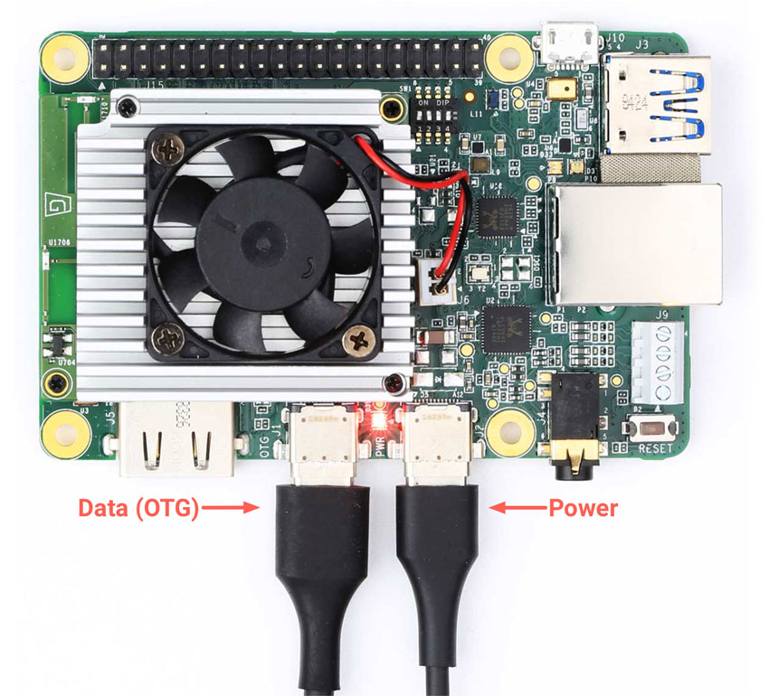
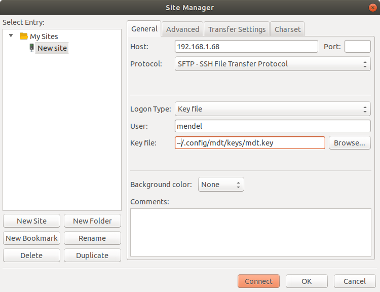

# Embedded Target
This section targets machine learning to various targets.  This includes Nvidia Jetson 
AGX Xavier, Nvidia Jetson NX, Corel.io dev board, and Raspberry Pi.  It also includes 
the TensorRT, Triton, and Tensorflow Lite toolsets.

## Nvidia Jetson Development
Machine learning targeting NVIDIA Jetson begins a problem a dataset.  These instructions
begin with the problem of [image segmentation](https://en.wikipedia.org/wiki/Image_segmentation) based on the [COCO dataset](https://cocodataset.org).  Next we need a trained network which we have created with [train.py](../segment/README.md).  "train.py" produces SavedModel output.

### Development PC Setup
- Begin with a deep learning compuer (e.g. [lambda workstation](https://lambdalabs.com/)).  My prefered development GPUs now are [Titan RTX](https://www.nvidia.com/en-us/deep-learning-ai/products/titan-rtx/) with 24GB memory for big models and batch sizes.  The rule of thumb of 2x system meomory vs GPU memory == lots of memory.  IN addition to 2GB SSD for the OS and programs, add enough storage to store big datases.  My preference is ~ 10TB 3.5" HDD for lots of storage at a moderate cost.
- On the Development PC: Install Ubuntu 18.04, [Visual Studio Code](https://code.visualstudio.com/), the lateest [NVIDIA drivers](https://developer.nvidia.com/cuda-downloads?target_os=Linux&target_arch=x86_64&target_distro=Ubuntu&target_version=1804&target_type=deblocal), [docker](https://www.docker.com/products/docker-desktop), and the [NVIDIA docker extension](https://github.com/NVIDIA/nvidia-docker )
- In Visual Studio Code, install RemoteSSH extension by Microsoft
- Load the mllib project.  From the command prompt:
```console
sudo mkdir /data
sudo chown $USER /data
mkdir /data/git
cd /data/git
git https://github.com/bhlarson/mllib.git
```

### Nvidia Jetson Setup:
- Follow [JetPack 4.4 install instructions](https://developer.nvidia.com/embedded/jetpack)  specific hardware 

- Set docker permissions
```console
$ sudo groupadd docker
$ sudo usermod -aG docker $USER
$ newgrp docker 
```
- install jetson-stats to use resource utilization:
```console
$ sudo apt update
$ sudo apt install python3-pip
$ sudo -H pip3 install -U jetson-stats
$ sudo reboot
$ jtop
```
- Load mllib
```console
$ sudo mkdir /data/git
$ chown blarson /data
$ mkdir /data/git
$ cd /data/git
$ git clone https://github.com/bhlarson/mllib.git
$ cd mllib
```
- In the remote SSH visual stuido code window, open /data/git/mllib
- To build docker image, open a Remote SSH console
```console
$ cd /data/git/mllib
$ ./drjb
```
- To build docker image, open a Remote SSH console
```console
$ cd /data/git/mllib
$ ./drjb
```
- Connect OpenCV recognized camera
- Copy saved model 2020-09-07-16-16-50-dl3 to /data/git/mllib/saved_model/2020-09-07-16-16-50-dl3
- Run 
```console
$ ./dr
# py serve/app.py -loadsavedmodel './saved_model/2020-09-07-16-16-50-dl3'
```
### Links
- [Jetson Developer Guide](https://docs.nvidia.com/jetson/l4t/index.html)
- [User Guide](https://developer.download.nvidia.com/assets/embedded/secure/jetson/xavier/docs/nv_jetson_agx_xavier_developer_kit_user_guide.pdf)
- [Jetpack Release Notes](https://docs.nvidia.com/jetson/jetpack/release-notes/index.html)
- [Jetson Downloads](https://developer.nvidia.com/embedded/downloads)

## TensorRT
This process of TensorRT inference is based on the [TensorRT Developer-Guide](https://docs.nvidia.com/deeplearning/tensorrt/developer-guide/).  Begin by building a trained segmentation network as describe in [../segment/README.md](../segment/README.md)
1. Build dockerfile_trt development docker environment with dbtrt script: docker build --pull -f "dockerfile_trt" -t trt:latest "context"
```console
$ ./dbtrt
```
2. run dockerfile_trt development docker environment script wihth drjb script to load docker envirnment:
```console
$ ./drtrt
```
description:
- docker run : run docker image
- --gpus '"device=0"' 
- -it : creating an interactive bash shell in the container
- --rm : Automatically remove the container when it exits
- --cap-add=CAP_SYS_ADMIN 
- -v "$(pwd):/app" : map map the current working directory to docker image volume /app
- -v "/store:/store" : map volume /store to docke image volume /store
- -p 5001:5000/tcp : map port 5001 to docker port 5000 for flask server
- -p 3000:3000 : map port 3000 to docker image port 3000 for Visual Studio Code debugging
- --device /dev/video0:/dev/video0 : map /dev/video0 device to docker image as /dev/video0
- trt:latest : docker image to run

3. Use TF-TRT to convert savedmodel to TensorRT Model:
```console
# py target/trt.py -savemodel ./saved_model/2020-09-04-05-14-30-dl3
```
3 (alt) Convert from Tensorflow SavedModel to ONNX model to TensorRT Model.  Despite the extra step, this path is recommended in Nvidia documentation and has support for many neural network structurs.

4.Inference uisng the Pythion TensorRT engine:


## Google Corel.io dev board:
https://coral.ai/products/dev-board/
Enable SSH : https://stackoverflow.com/questions/59325078/cannot-connect-to-coral-dev-board-after-updating-to-4-0-mdt-shell-does-not-work#
1) use ssh-keygen to create private and pub key files.
2) append (or copy) the pubkey file to target /home/mendel/.ssh/authorized_keys
3) copy the private key file to ~/.config/mdt/keys/mdt.key
4) add to local .ssh/config to something like this:

Host tpu
         IdentityFile ~/.config/mdt/keys/mdt.key
         IdentitiesOnly=yes


## To start the serial consol:

> sudo screen /dev/ttyUSB0 115200

## ssh over USB

> mdt shell

## ssh over Ethernet/WIFI
> mdt devices # get network address over OTG connection 
Returns network name and address
eml             (192.168.1.69) 

>  ssh mendel@192.168.1.69

## sftp in Nautilu (Ubuntu file browser)
Add named configuration to ssh;
> gedit ~/.ssh/config

Add configuraiton with specified IP address:

Host eml
	 HostName 192.168.1.69         
	 IdentityFile ~/.config/mdt/keys/mdt.key
         IdentitiesOnly=yes
         User mendel


## sftp filezilla
> filezilla

Select File->Site Manager



Enable SSH : https://stackoverflow.com/questions/59325078/cannot-connect-to-coral-dev-board-after-updating-to-4-0-mdt-shell-does-not-work#
1) use ssh-keygen to create private and pub key files.
2) append (or copy) the pubkey file to target /home/mendel/.ssh/authorized_keys
3) copy the private key file to ~/.config/mdt/keys/mdt.key
4) add to local .ssh/config to something like this:

Host tpu
         IdentityFile ~/.config/mdt/keys/mdt.key
         IdentitiesOnly=yes

Docker build training/test image
> docker build --pull --rm -f "dockerfile" -t ml:latest context
> docker run --gpus '"device=0"' -it --rm -v "$(pwd):/app" -v "/store/Datasets:/store/Datasets" -p 6006:6006/tcp -p 3000:3000 mllib:latest

Jupyter notebook development:
docker pull jupyter/tensorflow-notebook

<ol type="1">
    <li>System Setup</li>
        <ol type="a">
            <li>Ubuntu</li>
                <ol type="i">
                    <li>os</li>
                    <li>ssh</li>
                    <li>file system</li>  
                </ol>
            <li>MicroK8s or Kubernetes</li>
                <ol type="i">
                    <li>docker</li>
                    <li>snap</li>
                    <li>microk8s</li>  
                </ol>
            <li><a href=https://zero-to-jupyterhub.readthedocs.io/en/latest/setup-jupyterhub/index.html>Jupyter Hub</a> </li>
            <li> <a href=https://min.io>MINIO</a> data storage
            <li><a href=https://github.com/opencv/cvat>CVAT</a></li>  
        </ol>
    <li>Collect images for training, test and validation</li>
    <li>Annotation images using</li>
    <li>Convert annotations to TFRecord training set</li>
        <ol type="a">
            <li></li>
        </ol>
    <li>Select segmentation model</li>
    <li>Select inference hardware</li>
    <li>Select inference server</li>
    <li>Train model</li>
    <li>Verify trained model</li>
    <li>Optimize model for inference hardware</li>
    <li>Deploy to inference hardware</li>
    <li>Validate inference results</li>
    <li></li>
    <li></li>
        <ol type="a">
            <li></li>
            <li></li>
            <li></li>
        </ol>
    <li></li>
    <li></li>
</ol>

## TensorRT conversion of Tensorflow saved model
```console
$ 
# py target/trt.py -debug
```

# Notes:
- 1. Development docker image
   > docker run --device=/dev/video0:/dev/video0 --gpus '"device=0"' -it --rm -v "$(pwd):/app" -v "/store:/store" -p 8889:8888/tcp -p 8009:8008/tcp -p 5001:5000/tcp -p 3001:3000 ml:latest