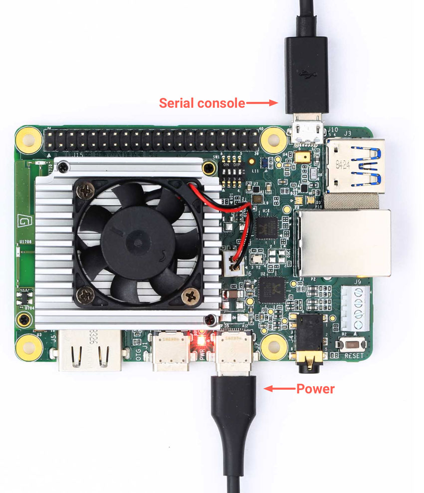

Google Corel.io dev board:
https://coral.ai/products/dev-board/
Enable SSH : https://stackoverflow.com/questions/59325078/cannot-connect-to-coral-dev-board-after-updating-to-4-0-mdt-shell-does-not-work#
1) use ssh-keygen to create private and pub key files.
2) append (or copy) the pubkey file to target /home/mendel/.ssh/authorized_keys
3) copy the private key file to ~/.config/mdt/keys/mdt.key
4) add to local .ssh/config to something like this:

Host tpu
         IdentityFile ~/.config/mdt/keys/mdt.key
         IdentitiesOnly=yes

## To start the serial consol:

> sudo screen /dev/ttyUSB0 115200

## ssh over USB

> mdt shell

## ssh over Ethernet/WIFI
> mdt devices # get network address over OTG connection 
Returns network name and address
eml             (192.168.1.69) 

>  ssh mendel@192.168.1.69

## sftp in Nautilu (Ubuntu file browser)
Add named configuration to ssh;
> gedit ~/.ssh/config

Add configuraiton with specified IP address:

Host eml
	 HostName 192.168.1.69         
	 IdentityFile ~/.config/mdt/keys/mdt.key
         IdentitiesOnly=yes
         User mendel

## sftp filezilla
> filezilla

Select File->Site Manager

