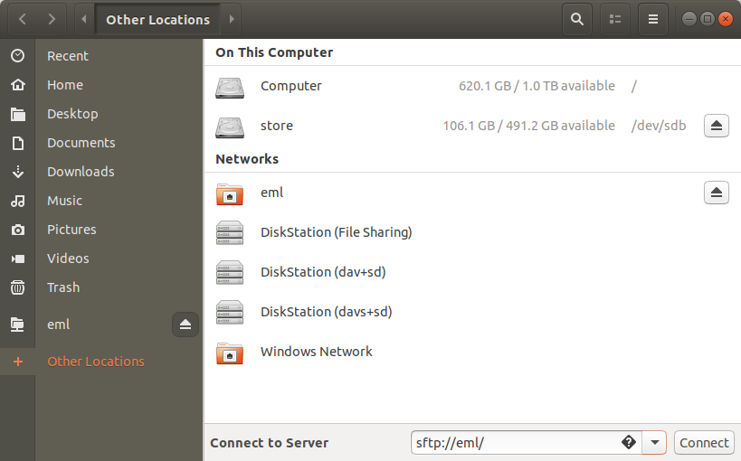

## Nvidia Jetson AGX Xavier
[Jetson Developer Guide](https://docs.nvidia.com/jetson/l4t/index.html)
[User Guide](https://developer.download.nvidia.com/assets/embedded/secure/jetson/xavier/docs/nv_jetson_agx_xavier_developer_kit_user_guide.pdf)


[Jetpack Release Notes](https://docs.nvidia.com/jetson/jetpack/release-notes/index.html)

[Jetson Downloads](https://developer.nvidia.com/embedded/downloads)

- Install Jetson Jetpack on
- Development PC: In Visual Studio Code, install RemoteSSH extension by Microsoft
- Set docker permissions
```console
$ sudo groupadd docker
$ sudo usermod -aG docker $USER
$ newgrp docker 
```
- install jetson-stats to use resource utilization:
```console
$ sudo apt update
$ sudo apt install python3-pip
$ sudo -H pip3 install -U jetson-stats
$ sudo reboot
$ jtop
```
- Load mllib
```console
$ sudo mkdir /data/git
$ chown blarson /data
$ mkdir /data/git
$ cd /data/git
$ git clone https://github.com/bhlarson/mllib.git
$ cd mllib
```
- In the remote SSH visual stuido code window, open /data/git/mllib
- To build docker image, open a Remote SSH console
```console
$ cd /data/git/mllib
$ ./drjb
```
- To build docker image, open a Remote SSH console
```console
$ cd /data/git/mllib
$ ./drjb
```
- Connect OpenCV recognized camera
- Copy saved model 2020-09-07-16-16-50-dl3 to /data/git/mllib/saved_model/2020-09-07-16-16-50-dl3
- Run 
```console
$ ./dr
# py serve/app.py -loadsavedmodel './saved_model/2020-09-07-16-16-50-dl3'
```


## Nvidia Jetson AGX NX
## Google Corel.io dev board:
https://coral.ai/products/dev-board/
Enable SSH : https://stackoverflow.com/questions/59325078/cannot-connect-to-coral-dev-board-after-updating-to-4-0-mdt-shell-does-not-work#
1) use ssh-keygen to create private and pub key files.
2) append (or copy) the pubkey file to target /home/mendel/.ssh/authorized_keys
3) copy the private key file to ~/.config/mdt/keys/mdt.key
4) add to local .ssh/config to something like this:

Host tpu
         IdentityFile ~/.config/mdt/keys/mdt.key
         IdentitiesOnly=yes


## To start the serial consol:

> sudo screen /dev/ttyUSB0 115200

## ssh over USB

> mdt shell

## ssh over Ethernet/WIFI
> mdt devices # get network address over OTG connection 
Returns network name and address
eml             (192.168.1.69) 

>  ssh mendel@192.168.1.69

## sftp in Nautilu (Ubuntu file browser)
Add named configuration to ssh;
> gedit ~/.ssh/config

Add configuraiton with specified IP address:

Host eml
	 HostName 192.168.1.69         
	 IdentityFile ~/.config/mdt/keys/mdt.key
         IdentitiesOnly=yes
         User mendel




## sftp filezilla
> filezilla

Select File->Site Manager

