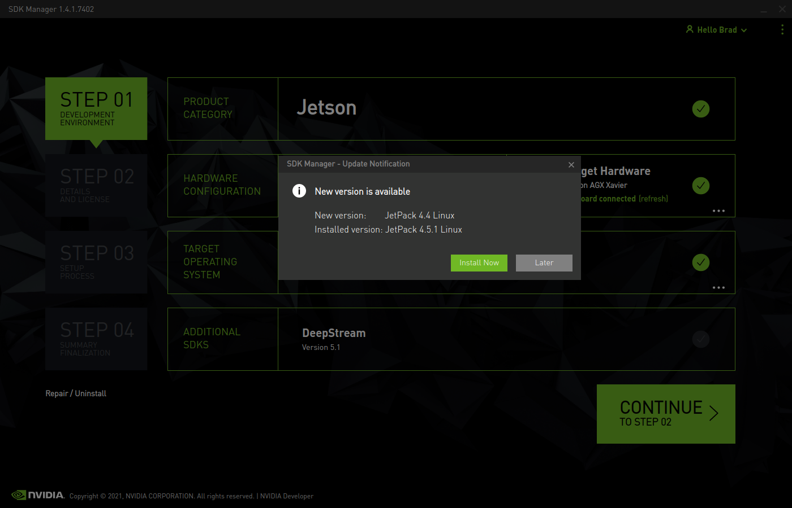
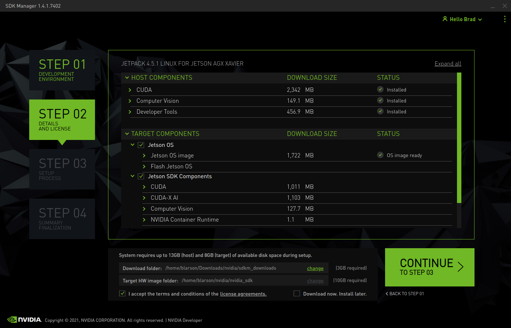
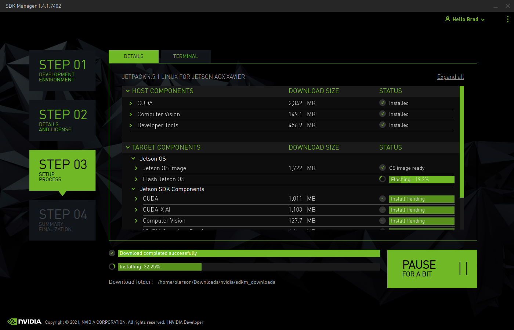

[Developer Kit](https://developer.nvidia.com/jetson-agx-xavier-developer-kit-user-guide)

[Update Jetpack with Packet Manager](https://docs.nvidia.com/jetson/jetpack/install-jetpack/index.html#package-management-tool)

[Install with SDK Manager](https://docs.nvidia.com/sdk-manager/install-with-sdkm-jetson/index.html)

[Upgrade with package manager](https://docs.nvidia.com/jetson/jetpack/install-jetpack/index.html#upgrade-jetpack)

1. Power down the Jetson AGX
1. Plug in the Jetson AGX front USB port into the system where the NVIDIA Jetson SDK mananger is installed as shown:

1. Start the SDK manager application  
1. Press and release AGX power button and force recovery button together \
 <br />
1. Download jetpack updates
 <br />
1. Accept terms and conditions, uncheck "Download now. Install Later" and select continue
 <br />
1. Verify download and install occurs
 <br />
1. With monitor, kyboarard, and mouse connected, configure the jetson


1. Mount NVME drive
1. [Docker post install steps](https://docs.docker.com/engine/install/linux-postinstall/)
1. [Set docker storage directory](https://www.ibm.com/support/knowledgecenter/SSBS6K_3.2.x/installing/docker_dir.html)

```console
# Find current jetpack release
$ cat /etc/nv_tegra_release
# Set to desired version.  Now r32.5.  Is this step necessary?
$ sudo nano /etc/apt/sources.list.d/nvidia-l4t-apt-source.list
# Update package manager
$ sudo apt update
$ sudo apt dist-upgrade -y
$ sudo apt install nvidia-jetpack -y
$ sudo apt autoremove
# Find current jetpack release
$ cat /etc/nv_tegra_release
```


```console
$ sudo systemctl stop docker
$ sudo nano /etc/default/docker
```

```console
# Docker Upstart and SysVinit configuration file

#
# THIS FILE DOES NOT APPLY TO SYSTEMD
#
#   Please see the documentation for "systemd drop-ins":
#   https://docs.docker.com/engine/admin/systemd/
#

# Customize location of Docker binary (especially for development testing).
#DOCKERD="/usr/local/bin/dockerd"

# Use DOCKER_OPTS to modify the daemon startup options.
#DOCKER_OPTS="--dns 8.8.8.8 --dns 8.8.4.4"

# If you need Docker to use an HTTP proxy, it can also be specified here.
#export http_proxy="http://127.0.0.1:3128/"

# This is also a handy place to tweak where Docker's temporary files go.
#export DOCKER_TMPDIR="/mnt/bigdrive/docker-tmp"
```

```console
# Docker Upstart and SysVinit configuration file

#
# THIS FILE DOES NOT APPLY TO SYSTEMD
#
#   Please see the documentation for "systemd drop-ins":
#   https://docs.docker.com/engine/admin/systemd/
#

# Customize location of Docker binary (especially for development testing).
#DOCKERD="/usr/local/bin/dockerd"

# Use DOCKER_OPTS to modify the daemon startup options.
#DOCKER_OPTS="--dns 8.8.8.8 --dns 8.8.4.4"
DOCKER_OPTS="-g /data/docker"

# If you need Docker to use an HTTP proxy, it can also be specified here.
#export http_proxy="http://127.0.0.1:3128/"

# This is also a handy place to tweak where Docker's temporary files go.
export DOCKER_TMPDIR="/data/docker-tmp"
```

```console
$ sudo systemctl start docker
```