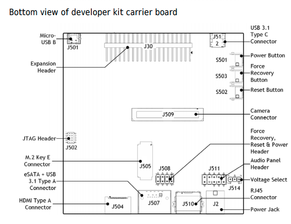

[Developer Kit](https://developer.download.nvidia.com/assets/embedded/secure/jetson/xavier/docs/jetson_agx_xavier_developer_kit_user_guide.pdf?kKWsgCKZC-0EGzvwHkq7uAGW7gqFG2fqxCMuhwI1ASEUb8JFp9JbPov4gVM2nWNRZbuFpOSOatQ3Ln8Urlufps9inIMvLQrYGow0AwwaP5DvWFKUPIzqWCfzs8raXNmQEpWnlCZb2T9y9XprGl3hbqMOQfS8B0fF3QBCv38VAqm1bPKmfKNl-DAkN6_dpcId_vxkYfFNCg)

[Update Jetpack with Packet Manager](https://docs.nvidia.com/jetson/jetpack/install-jetpack/index.html#package-management-tool)

[Install with SDK Manager](https://docs.nvidia.com/sdk-manager/install-with-sdkm-jetson/index.html)

[Upgrade with package manager](https://docs.nvidia.com/jetson/jetpack/install-jetpack/index.html#upgrade-jetpack)




```console
# Find current jetpack release
$ cat /etc/nv_tegra_release
# Set to desired version.  Now r32.5.  Is this step necessary?
$ sudo nano /etc/apt/sources.list.d/nvidia-l4t-apt-source.list
# Update package manager
$ sudo apt update
$ sudo apt dist-upgrade -y
$ sudo apt install nvidia-jetpack -y
$ sudo apt autoremove
# Find current jetpack release
$ cat /etc/nv_tegra_release
```